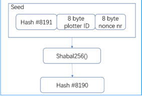
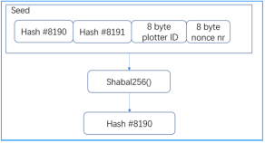
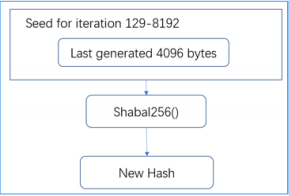
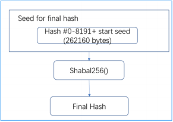
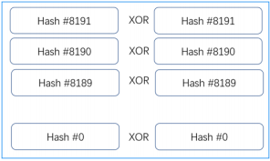
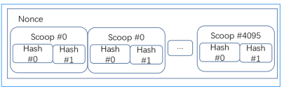
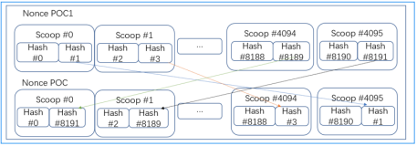

POC(Proof of Capacity)

##### Plot
 Miner plots file at local hard disk, and uses hash value to fill the disk.
 The larger the storage space, the more hash value could be filled, and higher block generation
rate.
 Hash algorithm uses Shabal256, which is anti-ASIC
 
#####Deadline
When you mine and process Plot files, you end up with a value called deadline. These values
represent the number of seconds that must pass since the forging of last block before block-forging
is allowed. If no one else forges a block during this period, you can forge a block and get a block
reward.

 
#####Plotting — Create Plot File
Shabal: Shabal is the name of the crypto/hash function used in GNC. It is a rather heavy and slow
crypto compared to many other alternatives like SHA256. Thus Shabal is a good crypto for Proof of
capacity coins like GNC, because we store the precomputed hashes while it is still fast enough to do
smaller live verifications. GNC uses the 256bit version of Shabal, which is also known as Shabal256.
 
 
 
######Nonce: 
When generating a plot file, you generate something that is called nonces. Each nonce
contains 256Kilobyte of data that can be used by miners to calculate Deadlines. Each nonce has its
individual number. This number can range between 0-18446744073709551615. The number is also
used as a seed when creating the nonce, so each nonce has its own unique set of data. One plot
file can contain many nonces
 
 
 
######Scoop: 
Each nonce is sorted into 4096 different places of data. These places are called scoop
numbers. Each scoop contains 64byte of data which holds 2 hashes. Each of these hashes are
xored with a final hash (we get to final hash while generating a nonce chapter).
 
 
 
######Plot ID: 
When you create your plot file it will be bound to a specific BHD account. The numeric
account ID is used when you create your nonces. Because of this all miners have different plot files
even if they use the same nonce numbers.

#####Generating a Nonce
The first step in creating a nonce is to make the first seed. The seed is a 16byte long value containing
the Plot ID and the nonce number. When this is done we start to feed the Shabal256 function to get
our first hash.
 

 
We have produced the first hash. This is the last hash in the nonce. Hash #8191. Now we take this
produced hash (#8191) and pre-append it to the starting seed. The result will now be our new seed
for the next round of shabal256 computation.
 

 
We now have produced two hashes. Hash #8191 and Hash #8190. This time we pre-append Hash
8190 to the last seed we used. The result will now be a new seed to feed Shabal256.
 

 
Once again, we have created a new hash.
This procedure of pre-appending resulting hashes to a new seed will continue for all 8192 hashes
we create for a nonce. After iteration 128 we have reached more than 4096 bytes in the seed. For
all remaining iterations we will only read the last 4096 generated bytes.
 

 
Once we have created 8192 hashes we are now going to make a Final hash. This is done by using
all 8192 hashes and the first 16bytes as seed.
 

 
The final hash will now be used to xor all other hashes individually.
 

 
We have now created our nonce and can store it in a plot file before we continue to the next nonce.
 

 

######POC Format
The POC2 nonce format is created the same way as POC1 with a slight addition to the end of the
process. To create a POC2 formatted nonce we need to shuffle the data around.
The data shuffling process:
Dividing the nonce in 2 halves, get a range with scoops 0-2047 and 2048-4095.
Name 0-2047 the low scoop range and 2048-4095 the high scoop range.
Take the second hash from a scoop in the low range, and swap it with the second hash in its mirror
scoop found in the high range. The mirror scoop is calculated like this:
MirrorScoop = 4095 – CurrentScoop
 

 

